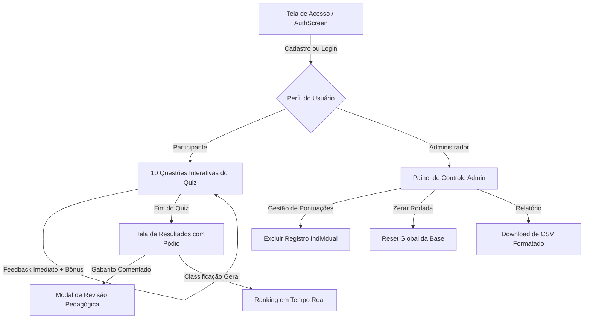

# ⚖️ Quiz ECA Digital — Defensoria Pública do Estado do Rio de Janeiro (DPRJ)

Aplicação web interativa gamificada desenvolvida para eventos, ações educativas e feiras institucionais da **Defensoria Pública do Estado do Rio de Janeiro (DPRJ)**, com foco na conscientização sobre os direitos de crianças e adolescentes no ambiente digital (**ECA Digital**, LGPD e proteção integral).

Possui controle de acesso obrigatório (cadastro e login com senha criptografada), painel administrativo para gestores da DPRJ, e suporte completo a **Node.js/Express** e **Google Apps Script (GAS)** com **Google Sheets**.

---

## 📌 Sumário
- [Visão Geral e Objetivos](#-visão-geral-e-objetivos)
- [Gerenciamento de Acesso (Cadastro e Login com Senha)](#-gerenciamento-de-acesso-cadastro-e-login-com-senha)
- [Painel Administrativo do Organizador (Admin DPRJ)](#-painel-administrativo-do-organizador-admin-dprj)
- [Jornada do Usuário e Fluxo](#-jornada-do-usuário-e-fluxo)
- [Garantia de Qualidade e Teste de Concorrência (50+ Usuários)](#-garantia-de-qualidade-e-teste-de-concorrência-50-usuários)
- [Deploy no Render (Cloud 24/7 - Guia Passo a Passo)](#-deploy-no-render-cloud-247---guia-passo-a-passo)
- [Deploy no Google Apps Script (Guia Passo a Passo)](#-deploy-no-google-apps-script-guia-passo-a-passo)
- [Como Executar Localmente](#-como-executar-localmente)
- [Como Executar os Testes Automatizados](#-como-executar-os-testes-automatizados)

---

## 🎯 Visão Geral e Objetivos

O **Quiz ECA Digital** tem como missão levar a discussão jurídica e pedagógica sobre o uso seguro, ético e protegido da tecnologia para jovens, pais, educadores e operadores do direito.

### Temas Abordados nas 10 Questões:
1. **Responsabilidade Compartilhada:** Família, redes sociais, sociedade e Estado no dever de proteção.
2. **Design Persuasivo e Algoritmos:** Autoplay, rolagem infinita e captura de atenção infantojuvenil.
3. **Inteligência Artificial e Vínculo Afetivo:** Limites éticos, transparência e manipulações psicológicas.
4. **Verificação Efetiva de Idade:** Insuficiência de autodeclarações em conteúdos adultos.
5. **Privacidade e LGPD:** Princípio da finalidade, necessidade e dados de menores.
6. **Publicidade Infantil Disfarçada:** Vedação ao marketing abusivo e influenciadores mirins.
7. **Saúde Mental e Autoimagem:** Espirais de recomendação algorítmica e filtros estéticos.
8. **Sharenting e Direito à Imagem:** Intimidade e vontade progressiva de crianças e jovens.
9. **Exposição Vexatória na Internet:** Limites entre memória familiar e violação de dignidade.
10. **Trabalho Infantil Digital:** Condições legais, proteção patrimonial e autorização judicial.

---

## 🔐 Gerenciamento de Acesso (Cadastro e Login com Senha)

A aplicação exige autenticação prévia de todos os participantes:
- **Cadastro de Participante:** Nome, E-mail (login), Senha (mínimo 4 caracteres), Instituição/Escola e Avatar.
- **Segurança Criptográfica:** Hashing HMAC SHA-256 com Salt único por usuário tanto no Node.js quanto no Google Apps Script.
- **Sessão Persistente:** O participante permanece conectado durante a rodada do evento.

---

## 🛡️ Painel Administrativo do Organizador (Admin DPRJ)

Os organizadores e coordenadores da Defensoria Pública possuem um painel dedicado para gestão do evento:

### 🔑 Credenciais Padrão do Administrador:
- **E-mail:** `admin@defensoria.rj.def.br`
- **Senha Inicial:** `Dprj@2026`

### ⚡ Recursos do Painel Admin:
1. **Métricas em Tempo Real:** Cards de Total de Usuários Inscritos, Partidas Jogadas, Média de Pontos, Tempo Médio e Recorde.
2. **Gestão da Tabela de Ranking:** Visualização completa de pontuações com botão de **Excluir Pontuação Individual** (🗑️) para remover entradas de teste ou duplicidades.
3. **Gestão de Usuários Cadastrados:** Lista de participantes com dados institucionais e opção de exclusão.
4. **Exportação de Relatórios (CSV):** Download imediato de planilha compatível com Excel para premiações.
5. **Zerar Base de Dados:** Limpeza global com confirmação para reiniciar rodadas entre turmas ou dias de evento.

---

## 🚀 Jornada do Usuário e Fluxo



---

## 📊 Garantia de Qualidade e Teste de Concorrência (50+ Usuários)

| Métrica Avaliada | Resultado Obtido | Status |
| :--- | :--- | :---: |
| **Usuários Concorrentes Simultâneos** | **50 participantes** | ✅ Aprovado |
| **Taxa de Sucesso das Requisições** | **100.0% (50/50 conexões)** | ✅ Aprovado |
| **Tempo Total de Processamento** | **146 ms** | ✅ Ultra Rápido |
| **Latência Média de Envio de Placar** | **25.3 ms** (P95: 29ms) | ✅ Excelente |
| **Latência Média de Consulta do Ranking** | **23.6 ms** (P95: 30ms) | ✅ Excelente |
| **Autenticação & Hashing de Senhas** | SHA-256 + Salt único | ✅ Seguro |
| **Prevenção de Conflitos Concorrentes** | `LockService` (GAS) / Lock Assíncrono (Node) | ✅ Verificado |

---

## 🚀 Deploy no Render (Cloud 24/7 - Guia Passo a Passo)

O **Render** ([render.com](https://render.com)) é uma plataforma de nuvem moderna e robusta, ideal para hospedar o Quiz ECA Digital com alta disponibilidade, HTTPS gratuito automático, latência ultrabaixa e suporte nativo a celulares (**Android Chrome** e **iPhone Safari/Chrome**).

### 🛠️ Configurações Automáticas do Repositório:
- **Blueprint Pronto:** O arquivo [`render.yaml`](./render.yaml) já está configurado na raiz do repositório.
- **Dockerfile Multi-estágio:** Arquivo [`Dockerfile`](./Dockerfile) otimizado em Alpine Linux.
- **Variável de Armazenamento:** Suporte à variável `DATA_DIR` para persistência dos dados.
- **Monitoramento de Saúde:** Endpoint nativo de Health Check em `/api/health`.

---

### Opção 1: Deploy com 1 Clique via Blueprint (Recomendado)

1. Crie ou acesse sua conta no [Render (render.com)](https://render.com).
2. No painel inicial (Dashboard), clique em **New +** no canto superior direito ➔ selecione **Blueprint**.
3. Conecte sua conta do GitHub e selecione o repositório:
   👉 `fabiosilveira-dgidperj/QUIZ-ECA-Digital---DCOM`
4. O Render detectará automaticamente o arquivo `render.yaml`:
   - **Service Name:** `quiz-eca-digital-dprj`
   - **Runtime:** `Node`
   - **Plan:** `Free`
   - **Build Command:** `npm install && npm run build`
   - **Start Command:** `npm start`
   - **Health Check Path:** `/api/health`
5. Clique em **Apply**. Em cerca de 2 minutos, o Render construirá e publicará sua aplicação com um link seguro HTTPS (ex: `https://quiz-eca-digital-dprj.onrender.com`).

---

### Opção 2: Deploy Manual como Web Service

1. No Dashboard do Render, clique em **New +** ➔ **Web Service**.
2. Conecte o repositório do GitHub `QUIZ-ECA-Digital---DCOM`.
3. Preencha os campos conforme abaixo:
   - **Name:** `quiz-eca-digital`
   - **Region:** `Ohio (US East)` ou `Oregon (US West)`
   - **Branch:** `main`
   - **Root Directory:** *(deixe em branco)*
   - **Runtime:** `Node`
   - **Build Command:** `npm install && npm run build`
   - **Start Command:** `npm start`
   - **Instance Type:** `Free`
4. Expanda a seção **Advanced**:
   - Adicione as variáveis de ambiente:
     - `NODE_ENV` = `production`
     - `PORT` = `10000`
   - **Health Check Path:** `/api/health`
5. *(Opcional - Planos Pagos Starter):* Em **Disks**, adicione um disco persistente com Mount Path `/var/data` e defina a variável `DATA_DIR=/var/data` para que rankings e logins nunca sejam resetados em reinicializações do servidor.
6. Clique em **Create Web Service**.

---

## ☁️ Deploy no Google Apps Script (Guia Passo a Passo)

A pasta [`gas/`](./gas) contém todos os arquivos prontos:
- [`gas/Code.js`](./gas/Code.js): Backend Apps Script com autenticação (`loginUser`, `registerUser`), banco em duas abas (`Usuarios` e `Ranking`), `LockService` e `CacheService`.
- [`gas/index.html`](./gas/index.html): Bundle compilado único com todo o React 19, Tailwind CSS e áudio inlined.
- [`gas/appsscript.json`](./gas/appsscript.json): Manifesto do Web App.

### 🛠️ Como Implantar no script.google.com:

1. **Acesse:** **[https://script.google.com/home/?hl=pt-br](https://script.google.com/home/?hl=pt-br)**
2. Clique em **+ Novo projeto** e nomeie como: `Quiz ECA Digital - DPRJ`.
3. No arquivo `Código.gs` (ou `Code.gs`), apague o código e cole todo o conteúdo de [`gas/Code.js`](./gas/Code.js). Salve (**Ctrl+S**).
4. No menu esquerdo, clique no botão **+** (ao lado de *Arquivos*) ➔ **HTML** ➔ nomeie como `index` ➔ cole o conteúdo de [`gas/index.html`](./gas/index.html). Salve (**Ctrl+S**).
5. Clique em **Implantar** no topo direito ➔ **Nova implantação**:
   - Tipo: **App da Web** (⚙️)
   - Executar como: `Eu`
   - Quem pode acessar: `Qualquer pessoa`
6. Clique em **Implantar**, autorize o acesso e copie a URL pública gerada!

---

## 💻 Como Executar Localmente

```bash
# 1. Instalar dependências
npm install

# 2. Iniciar servidor local
npm run dev

# 3. Gerar novo bundle para Google Apps Script
npm run build:gas
```

---

## 🧪 Como Executar os Testes Automatizados

```bash
# Teste de Carga de 50 Usuários Simultâneos
npm run test:load

# Teste de Autenticação e Endpoints do Painel Admin
node scripts/test-auth-and-admin.mjs
```

---

## 📄 Licença e Créditos

Desenvolvido para a **Defensoria Pública do Estado do Rio de Janeiro (DPRJ)** — Direitos Digitais e Proteção Integral de Crianças e Adolescentes.
